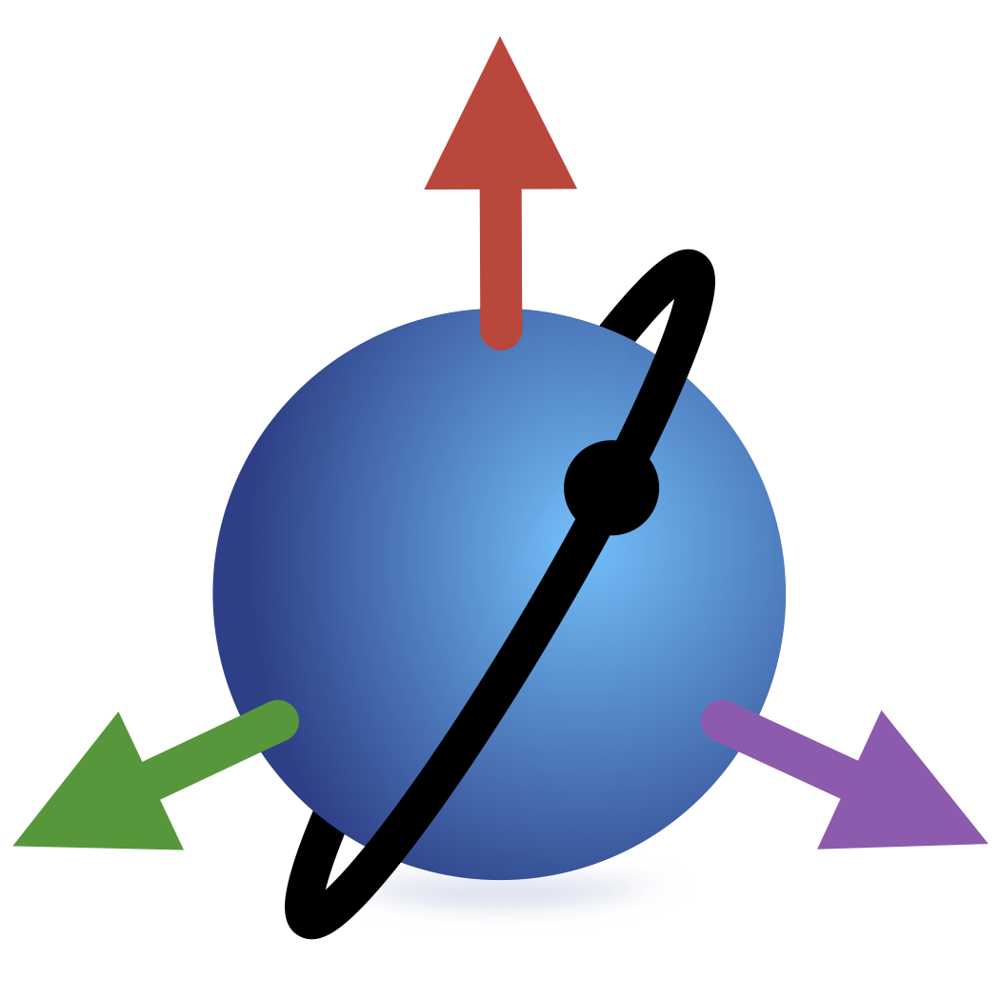

<p align="center">
  <br>
  <small><i>This package is part of the <a href="https://github.com/JuliaSpace/SatelliteToolbox.jl">SatelliteToolbox.jl</a> ecosystem.</i></small>
</p>

SatelliteToolboxGravityModels.jl
================================

[](https://github.com/JuliaSpace/SatelliteToolboxGravityModels.jl/actions/workflows/ci.yml)
[](https://codecov.io/gh/JuliaSpace/SatelliteToolboxGravityModels.jl)
[][docs-stable-url]
[][docs-dev-url]
[](https://github.com/invenia/BlueStyle)
[](https://github.com/JuliaSpace/SatelliteToolboxGravityModels.jl/blob/main/LICENSE)
[](https://zenodo.org/doi/10.5281/zenodo.10396094)

This package implements the support of gravity models for the **SatelliteToolbox.jl**
ecosystem. We can use it to obtain, for example, the gravitational acceleration to
implement highly accurate numerical orbit propagators.

Currently, we have the following functionalities:

- Compute the gravity field derivative in spherical coordinates;
- Compute the gravitational acceleration; and
- Compute the gravity acceleration, taking into account the body's rotation rate.

The package contains an API to allow the user to access any gravity model while computing
the previous functions. We also provide in-built support for
[ICGEM](http://icgem.gfz-potsdam.de/home) files.

## Installation

```julia
julia> using Pkg
julia> Pkg.add("SatelliteToolboxGravityModels")
```

## Documentation

For more information, see the [documentation][docs-stable-url].

[docs-dev-url]: https://juliaspace.github.io/SatelliteToolboxGravityModels.jl/dev
[docs-stable-url]: https://juliaspace.github.io/SatelliteToolboxGravityModels.jl/stable
